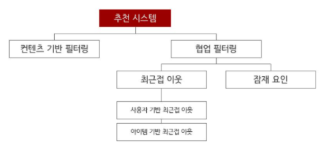
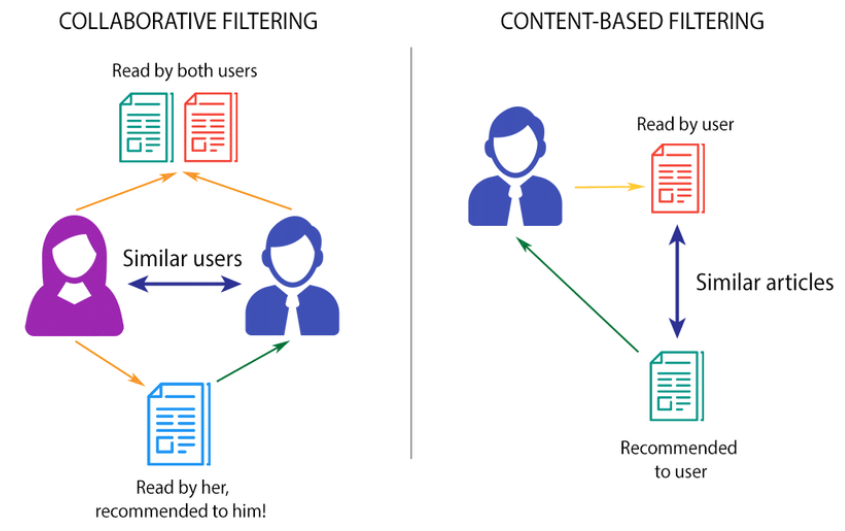

# 추천시스템(Recommendation System)
- 추천시스템은 크게 __협업 필터링(Collaborative Filtering) 방식__ 과 __컨텐츠 기반 필터링(Content based filtering) 방식__  나뉜다.

    
요즘에는 개인화 특성을 좀 더 강화하기 위해서 하이브리드 형식으로 콘텐츠 기반과 협업 기반을 적절히 결합해 사용하는 경우도 늘고 있습니다.

- __Collaborative Filtering__ vs __Content-Based Filtering__

### 1. Collaborative Filtering(협업 필터링)
`많은 사용자들로부터 얻은 기호 정보에 따라 사용자들의 관심사들을 자동적으로 예측하게 해주는 방법`
  - 최근접 이웃 협업필터링
    - 사용자 기반 추천
    - 아이템 기반 추천
  - 잠재요인 협업 필터링

__한계(Limitations)__
1) __콜드 스타트(Cold Start)__
   - 초기 단계에서 __시스템이 아직 충분한 정보를 모으지 못한 사용자에 대한 추론을 이끌어 낼 수없는 문제가 발생__
2) __계산 효율 저하__
  - 사용자가 일정 수준 이상이어야 정확한 결과를 낼 수 있는 반면, 시간이 더욱 많이 걸리게 된다는 단점을 갖고있다. 

3) __롱테일(Long Tail)__
  - 롱테일은 파레토법칙(전체 결과의 80%가 전체 원인의 20%에서 일어나는 현상)을 그래프로 나타내었을 때 꼬리처럼 긴 부분을 형성하는 80%의 부분을 일컫는 말이다. 
  - 이 현상을 협업 필터링에 적용하면, 사용자들이 관심을 많이 보이는 소수의 콘텐츠가 추천 콘텐츠로 보이는 비율이 높은 __'비대칭적 쏠림 현상'__ 이 발생한다는 의미이다. 

### 2. Content-Based Filtering(컨텐츠 기반 필터링)__
__컨텐츠 기반 필터링 방식은 사용자가 특정 아이템을 선호하는 경우, 그 아이템과__ __`비슷한 컨텐츠를 가진 다른 아이템`__ __을 추천해주는 방식__

---
본 Repository는 __머신러닝 완벽가이드 책 9장__ 과 구글링을 토대로 공부를 진행하였습니다.
- __기타 참고 링크__
  - https://github.com/jaewonlee-728/fastcampus-RecSys
  - https://lsjsj92.tistory.com/564